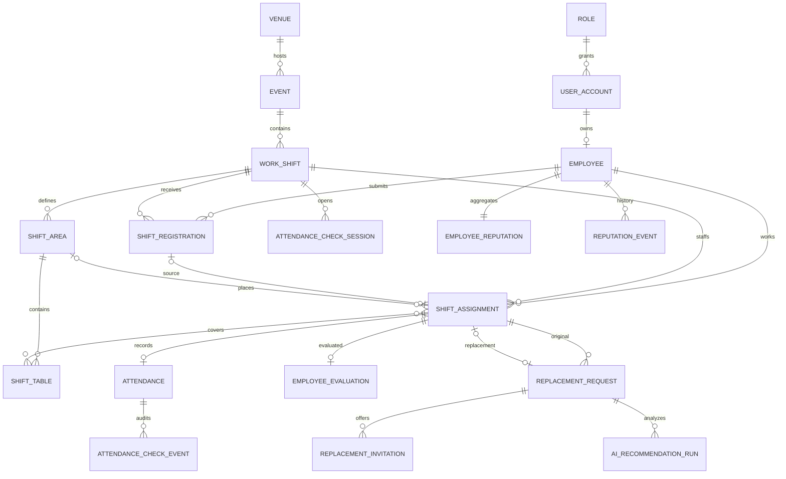
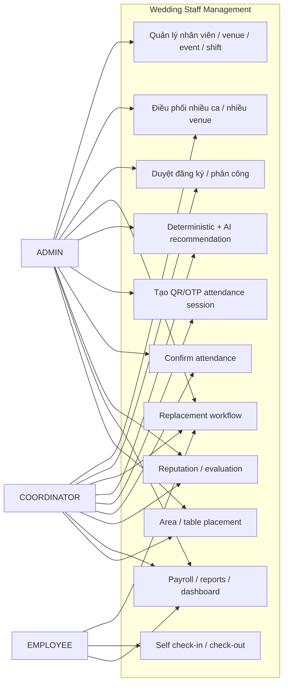
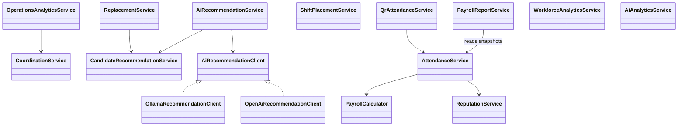
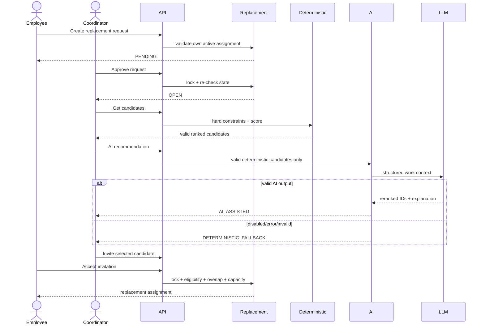
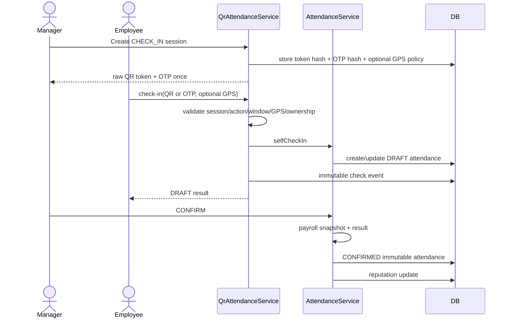
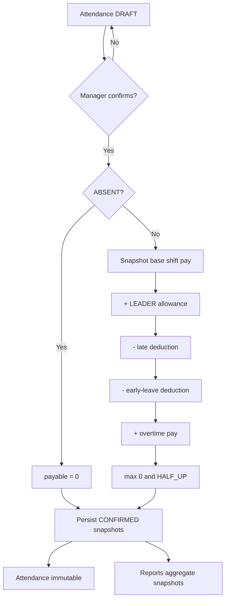
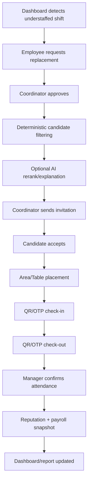

# DACN v1.0 — Architecture & Demo Diagrams

Các sơ đồ dưới đây là **conceptual diagrams** phục vụ báo cáo/demo. Chúng mô tả quan hệ nghiệp vụ chính, không thay thế physical schema của MySQL.

## 1. Conceptual ERD

## 2. Use-case view

## 3. Service-level class diagram

## 4. Replacement + AI sequence

## 5. QR / OTP attendance sequence

## 6. Payroll activity

## 7. End-to-end demo activity

